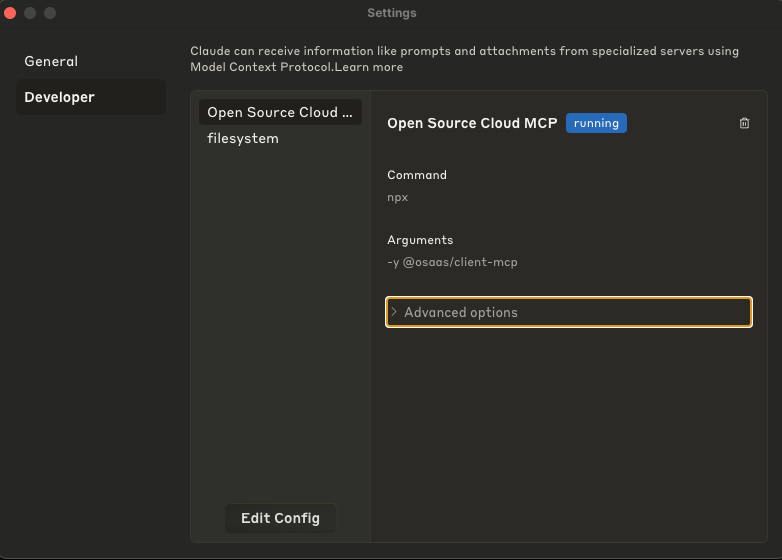

# Remote MCP client for Eyevinn Open Source Cloud


## Usage (Claude Desktop)

Add this to the Claude settings file (claude_desktop_config.json).


```json
{
  "mcpServers": {
    "remote-mcp-osc": {
      "command": "npx",
      "args": ["-y", "@osaas/client-mcp"],
      "env": {
        "OSC_ACCESS_TOKEN": "<osc-access-token>"
      }
    }
  }
}
```

Obtain the `<osc-access-token>` under Settings in the Eyevinn Open Source Cloud web user interface.

Restart Claude for the changes to take effect.

## Development

Using the Model Context Protocol inspector.

```bash
% npx @modelcontextprotocol/inspector \
  -e MCP_ENDPOINT=https://mcp.svc.dev.osaas.io \
  -e OSC_ACCESS_TOKEN=<osc-access-token> \
  npx tsx src/index.ts
```

## About Open Source Cloud

Open Source Cloud reduces the barrier to get started with open source without having to host it on your own infrastructure.

Start building software solutions based on open and detachable ready-to-run cloud components with Open Source Cloud. Full code transparency, never locked in and a business model that contributes back to the open source community. Offering a wide range of components from media and more to help you build the best solution for you and your users.

www.osaas.io
